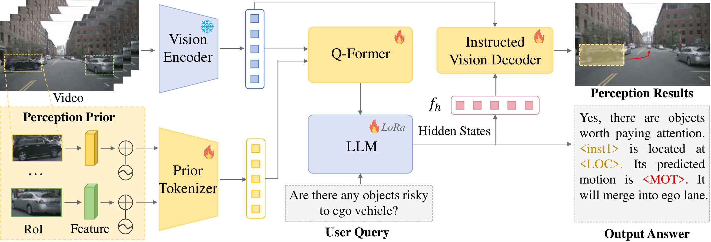

# Reason2Drive: Towards Interpretable and Chain-based Reasoning for Autonomous Driving
### [[Paper]](https://arxiv.org/abs/2312.03661) 

> [**Reason2Drive: Towards Interpretable and Chain-based Reasoning for Autonomous Driving**](https://arxiv.org/abs/2312.03661),          
> Ming Nie, Renyuan Peng, Chunwei Wang, Xinyue Cai, Jianhua Han, Hang Xu, [Li Zhang](https://lzrobots.github.io)  
> **Arxiv preprint**

## Introduction


This is the official implementation of [Reason2Drive: Towards Interpretable and Chain-based Reasoning for Autonomous Driving](https://arxiv.org/abs/2312.03661).

## BibTeX
If you find our work useful in your research, please consider citing our paper:
```
@article{nie2023reason2drive,
  title={Reason2Drive: Towards Interpretable and Chain-based Reasoning for Autonomous Driving},
  author={Nie, Ming and Peng, Renyuan and Wang, Chunwei and Cai, Xinyue and Han, Jianhua and Xu, Hang and Zhang, Li},
  booktitle={arXiv preprint},
  year={2023}
}
```

## Acknowledgements
We thanks for the opensource projects.
- [nuScenes](https://github.com/nutonomy/nuscenes-devkit)
- [LAVIS](https://github.com/salesforce/LAVIS)
- [MiniGPT-4](https://github.com/Vision-CAIR/MiniGPT-4)
