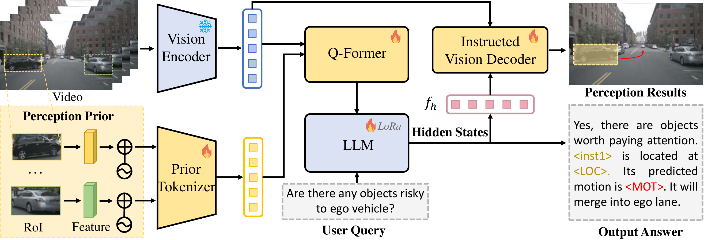

# Reason2Drive: Towards Interpretable and Chain-based Reasoning for Autonomous Driving
### [[Paper]](https://arxiv.org/abs/2312.03661) 

> [**Reason2Drive: Towards Interpretable and Chain-based Reasoning for Autonomous Driving**](https://arxiv.org/abs/2312.03661),          
> Ming Nie, Renyuan Peng, Chunwei Wang, Xinyue Cai, Jianhua Han, Hang Xu, [Li Zhang](https://lzrobots.github.io)  
> **Arxiv preprint**

## Introduction
This is the official implementation of [Reason2Drive: Towards Interpretable and Chain-based Reasoning for Autonomous Driving](https://arxiv.org/abs/2312.03661).
We introduce Reason2Drive, an autonomous driving benchmark with over 600K video-text pairs, aimed at facilitating the study of interpretable reasoning in complex driving environments.

## Annotation Schema

We first leverage a diverse array of publicly available datasets, including nuScenes, Waymo, and ONCE, and then parse their comprehensive object metadatas into JSON-structured entries.
Each object entry contains various details pertaining to its driving actions.
Afterwards, these extracted entries are filled into predefined templates, which are divided into different tasks (i.e., perception, prediction and reasoning) at both object-level and scenario-level.
Subsequently, GPT-4 and manual annotations are involved for verification and enrichment purposes.

## Dataset Stats

Reason2Drive dataset stands as the largest dataset to date, surpassing others in terms of both dataset size and the inclusion of extensive long-text chain-based reasoning references.

We split the dataset according to the task (perception, prediction and reasoning) and target.
The benchmark exhibits a balanced distribution.

## Methodology

The pipeline of our proposed framework.
The highlighted yellow box and red curve in the perception result image respectively represent the visualization of <LOC> and <MOT>.

## TODO
- [ ] Release benchmark
- [ ] Release evaluation code
- [ ] Release training code

## BibTeX
If you find our work useful in your research, please consider citing our paper:
```
@article{nie2023reason2drive,
  title={Reason2Drive: Towards Interpretable and Chain-based Reasoning for Autonomous Driving},
  author={Nie, Ming and Peng, Renyuan and Wang, Chunwei and Cai, Xinyue and Han, Jianhua and Xu, Hang and Zhang, Li},
  booktitle={arXiv preprint},
  year={2023}
}
```

## Acknowledgements
We thanks for the opensource projects.
- [nuScenes](https://github.com/nutonomy/nuscenes-devkit)
- [LAVIS](https://github.com/salesforce/LAVIS)
- [MiniGPT-4](https://github.com/Vision-CAIR/MiniGPT-4)
